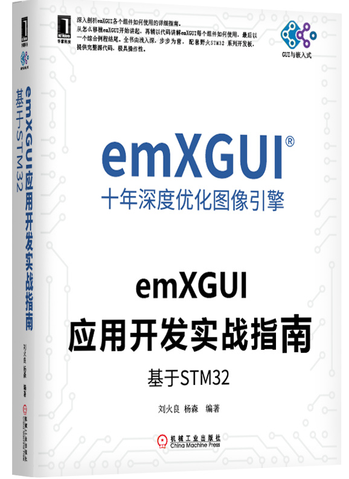
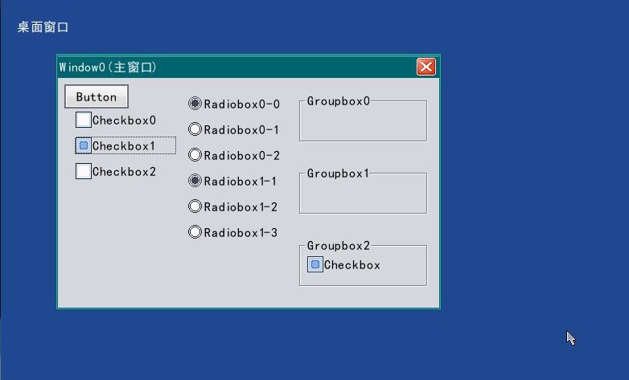
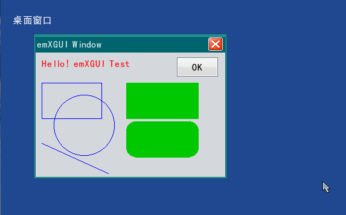
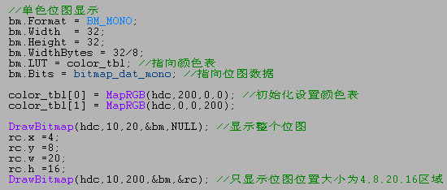
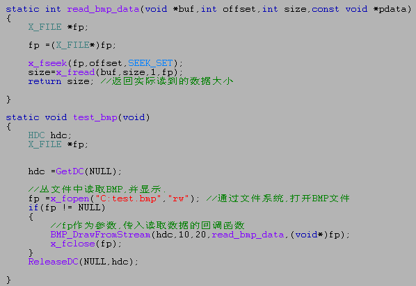
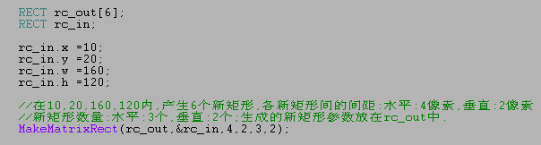
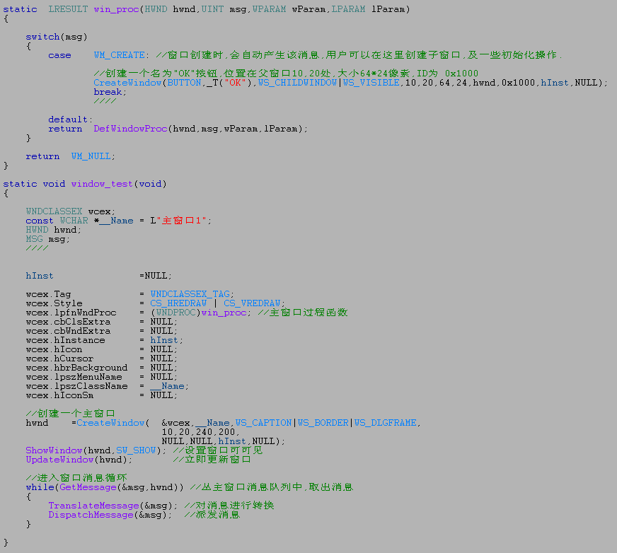
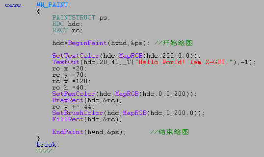

.. vim: syntax=rst

|emxgui002|
--------

**《emXGUI应用开发实战指南—基于STM32》**

|emxgui003|

**野火STM32固件库和RTOS书籍**

emXGUI版本说明
----------

====== ========== ===================================== ==========
版本号 时间       更新说明                              作者
====== ========== ===================================== ==========
V1.0.0 2008-07-06 首发（公司内部产品使用至今2018-7-25） AATECH刘巍
\
\
\
\
\
\
\
\
====== ========== ===================================== ==========

初识emXGUI
--------

emXGUI版权
~~~~~~~~

emXGUI由AATECH公司的刘巍编写，拥有完全自主的知识产权（包括emXGUI商标和软件著作权）。于2008年发布V1版本开始，十年深度优化，一直在公司产品中使用至今。

emXGUI收费
~~~~~~~~

emXGUI V1 版本商用免费，无论是个人还是公司均可免费使用。但是技术支持收费，即针对使用emXGUI开发产品的公司或者个人提供收费的技术支持。

源码
~~

emXGUI不开源源代码，但提供多平台的LIB文件，提供完善的API手册，提供配套书籍《emXGUI应用开发实战指南》无论是个人还是公司都可以很快的上手。

支持平台
~~~~

emXGUI目前测试过的平台如下，但主要目标还是针对M3、M4、M7、ARM9、A5这些内核的处理器，这个才是emXGUI的阵地，A8、A9等高端性能的处理器虽然能支持，但不是重点，不会花过多的精力去维护，毕竟这是安卓和Qt的阵地。

-  ST：STM32F1、STM32F4、STM32F7、STM32H7

-  GD：GD32F207、GD32F407、GD32F450

-  NXP：i.MX RT1052、I.MX RT1020

-  ATMEL：SAMA5D3

-  三星：s3c2440、s3c2416、s3c6410

-  芯唐：N32903、N32905、N32926、NUC972

-  Cortex-A系列：S5PV210、Exynos4412、IMX6Q

emXGUI特色功能
~~~~~~~~~~

这个是重点，目前你们所能见到的GUI有的功能，emXGUI几乎都有，下面简单介绍几个emXGUI的特色：

1、占用资源少，效率高，在STM32F103不外扩RAM的情况下可以流畅运行，最低推荐配置为：Cortex-M0 ，50MHZ ，32KB RAM ，128KB ROM。

2、控件风格支持用户重定义，如果你想改成扁平化的控件，只需几行代码即可搞定，emXGUI默认是WIN 风格。

3、友好地支持矢量字体，提供矢量字体制作工具，除了制作矢量字体外，还可以制作矢量的符号。

4、使用unicode字符编码支持多国语言，中文，英文，越南语，西班牙语等等，如果你的产品有界面且需要销往国外，那么emXGUI将是你不二之选。

5、支持鼠标，支持触摸（电阻屏和电容屏）。

5、自带滑动控件，非常方便，即在液晶屏上可以实现类似现在手机界面滑动的效果。

6、高性能的绘图引擎+高效的Z序剪切策略，双管齐下，自带瓦伦增压。

emXGUI资料获取
~~~~~~~~~~

emXGUI的资料均可从emXGUI官网和野火电子论坛emXGUI专区获取。

-  emXGUI官网：\ `www.emXGUI.com <http://www.emxgui.com>`__

-  野火电子论坛emXGUI专区：\ **http://www.firebbs.cn/forum.php?mod=forumdisplay&fid=149**

emXGUI配套书籍
~~~~~~~~~~

emXGUI的配套书籍由野火电子编写，书名为《emXGUI应用开发实战指南》，会有两本，分别基于STM32和i.MX RT 这两个平台处理器，会适配野火STM32和i.MX RT全系列的开发板。该书会编写边开源电子版，写完届时由机械工业出版社出版。

emXGUI配套的软件工具
~~~~~~~~~~~~~

-  emXGUI Font Creater，用于制作xft字体。xft字体是emXGUI自有默认的字体，支持1/4/8级抗锯齿，用户可自行定义和裁减字符数量及字符外形尺寸。

emXGUI基础概念及知识
-------------

绘图表面(Surface)
~~~~~~~~~~~~~

Surface是对绘图设备的描述，其内容记录了绘图设备的颜色格式，物理像素大小，显示缓冲区，以及绘图引擎（GAL），GUI所有的绘图目标，最终都是在Surface上进行。每个Surface都是一个独立的绘图设备，可以由用户自由创建。

绘图上下文(Drawing Context)
~~~~~~~~~~~~~~~~~~~~~~

Drawing Context 简称DC，基本上所有的绘图函数，都需要传入一个DC的对象参数。它保存了各种用户层的绘图参数：如画笔颜色PenColor(作用于画线，框类图形)，画刷颜色BrushColor(作用于填充实心类的图形)，文字颜色TextColor(作用于文本显示相关函数)，字体对象…等等
。用户可以通过对这些参数进行修改来达到改变绘图输出效果。

窗口及消息机制(Window & Message)
~~~~~~~~~~~~~~~~~~~~~~~~~

窗口类型及特征
^^^^^^^

窗口是对多区域绘图及管理的基本对象元素。emXGUI是原生的多窗口系统，支持同屏下任意数量窗口叠层显示，并且窗口尺寸是不受屏幕分辨率约束的，可以是任意大小和位置。emXGUI的窗口分为以下几类:桌面窗口，主窗口，子窗口/控件。

桌面窗口是GUI系统创建的第一个窗口，也称作是根窗口，是占据整个GUI屏幕的最底层窗口。桌面窗口是GUI必需存在的唯一根窗口，一旦创建运行后，是不可以被删除销毁的。

主窗口是由用户在应用程序中创建，是用户图形界面应用程序的主体核心部分。一个应用程序，可以是由一个主窗口构成，也可以是由多个主窗口组成，多个主窗口间，是可以相互叠加及切换的，当然这些具体的应用方式是由用户实际的应用策略来决定，emXGUI只是给用户提供了这些丰富灵活的机制供驱使。当主窗口工作结束时，用
户可以对其进行删除/销毁，以回收不需再使用的资源。

子窗口是限定在主窗口范围内，是属于主窗口的私有资源，一般泛指各种控件：如按钮、复选框、进度条、列表框…等等。在主窗口创建时，可同时为其创建子窗口/控件。灵活运用emXGUI的子窗口/控件相关机制，可以极大提升应用程序代码资源的重用率用高可扩展性。比如，用户可对已有控件的默认行为及外观进行改变；或者用
户需自定义制作一款特殊的私有控件；甚至用户可以将一个复杂的窗口程序制作成一个控件来供使用，比如可以将一个完整播放器的界面控制程序都做成一个控件，以后只要在需要的地方，直接创建这个控件子窗口就可以了…限于本章篇幅，这里不作详说，后续将有章节会详细讲解这些机制的应用实例。当一个控件不需要再使用，用户也同
样可以对其进行删除/销毁；另外在这里，用户需要了解的一项规则是：一个窗口所属的私有资源（如控件，定时器），用户即便不删除/销毁它，当它的被拥有宿主窗口在删除/销毁时，它的私有资源也会被强制删除/销毁。用一个通俗点的方式描述就是：用户创建了一个主窗口A，并为其创建了一个按钮控件B，一个定时器C，当主窗
口A要结束并退出时，用户就算不删除按钮控件B和定时器C，GUI内部也会对这些未释放的资源进行强制删除/销毁。

|emxgui004|

图 3‑1窗口类型

窗口内部区域及坐标系统
^^^^^^^^^^^

窗口内部区域分为客户区与非客户区。窗口最外边的区域为非客户区，是包括了标题栏，窗口边框。非客户区的绘制内容，默认是由GUI内部处理的，用户可以不去关心，除非用户需要自行定制窗口非客户的外观。除开非客户区之外的地方，称为客户区，用户的绘图区域及子窗口，都是在客户区范围内。

|emxgui005|

图 3‑2 窗口区域

emXGUI的坐标以像素为单位，X轴向右为正，Y轴向下为正。按不同的窗口区域，坐标系分为屏幕坐标(Screen)，窗口坐标(Window)，客户坐标(Client)。这三类坐标系最明显区别在于坐标原点:屏幕坐标原点在显示设备的第一个物理像素点位置;窗口坐标原点在整个窗口(包括非客户区)的最左上角;客
户坐标在窗口客户区的最左上角。屏幕坐标，窗口坐标，客户坐标之间可以相互转换的，emXGUI给用户提供了相关的API函数，详细请参考API章节(ScreenToClient，WindowToClient，ClientToScreen，…)。在窗口非客户区绘图，应使用GetWindowDC来获得绘图上下
文(DC)， 非客户区的DC，使用的是窗口坐标，坐标原点在窗口最左上角，可以在整个窗口内绘制。在客户区内绘图，使用BeginPaint或GetDC(后续章节会介绍BeginPaint与GetDC的区别)。客户区DC使用的是客户区坐标，坐标原点为客户区最左上角，客户区DC只会在客户区范围内绘图，超出这
个范围内的绘图内容，将会被自动裁减掉。

消息机制概述
^^^^^^

emXGUI是以窗口为基础，以消息传递为运转机制的多窗口系统。通过消息机制，窗口可以响应来自输入设备(键盘，鼠标，触摸屏)的动作，如按键弹起/按下，鼠标/触摸屏位置改变。消息也可以在窗口与窗口间传递，以实现窗口间的交互动作。窗口在创建时，GUI内部会对其绑定一个所属的消息队列(这个过程动作是不需要用
户干预的)。在主窗口创建后，在一个循环里执行获取消息(GetMessage)，派发消息(DispatchMessage)，这样便是整个用户窗口系统的消息泵正常运转了， 获得到的消息将派发到所属窗口的窗口过程函数(WndProc)中。

消息发送方式
^^^^^^

向某个指定的窗口发送消息，按发送方式，可分为同步发送消息(SendMessage)和异步发送消息(PostMessage/PostAsyncMessage) 。同步消息发送也称为阻塞发送，发送消息时，会阻塞当前线程，直到该消息被目标窗口处理完成后，该函数才会返回，当前线程才能得以继续运行；同步消息是
不会进入消息队列的，直接发送到了目标窗口的窗口过程函数。相反，异步消息发送为非阻塞方式，被发送的消息只是投放目标窗口所属的消息队列中，而不等该消息是否被目标窗口处理便立即返回。emXGUI给用户提供了两个异步发送消息的函数：PostMessage和PostAsyncMessage。这两个函数的区别是
:PostMessage发送的消息队列容量长度是固定的，当这个队列消息已满的情况下，便不能再接收新的消息，也就是说在这个情况下，PostMessage因消息队列容量已满将会丢弃掉新的消息。一个很典型的情况：当窗口被另一个高优先级的任务长时间阻塞时，如果一直往这个窗口PostMessage，那么到一定
程度下，该窗口所属的消息队列便会被填满，使得不能再接收到新的PostMessage。而PostAsyncMessage情况则不同，PostAsyncMessage的发送消息队列容量是不固定的，可以理解为是一个不限长度的可动态增加的链表结构。每次PostAsyncMessage都将会在消息队列增加一条
消息，除非GUI内核的动态内存已消耗完。

消息接收与派发(窗口消息循环)
^^^^^^^^^^^^^^^

在用户创建完一个主窗口后，最后将在一个循环中调用GetMessage丛消息队列中获取消息。GetMessage是一个阻塞性获取消息的函数，只有消息队列中有消息时，该函数才会返回，并将获取的消息填充到一个MSG的结构体中，随后调用DispatchMessage函数将该获取到消息派发到目标窗口过程函数中
处理，这个过程也称作为窗口消息循环。消息派发到哪个窗口，这是不需要用户干预的， MSG
结构中的hwnd参数，已经指明了消息派往的目标窗口。需要注意一点的事，前面说到同步发送的消息(SendMessage)是不会进入消息队列的，而是直接发送到了窗口过程函数(WndProc)，所以GetMessage是不会获取到SendMessage发出的消息的。

MSG结构体参数如下图所示:

丛主窗口创建到窗口消息循环的示例代码如下：

消息处理与主窗口过程函数
^^^^^^^^^^^^

在用户创建主窗口时，需要提供一个为“消息处理回调函数”的函数地址。该函数即为窗口过程函数，是用户响应处理窗口消息的地方。在窗口过程函数中，用户只需处理有用到消息，不用的消息可以不理会，交由系统来处理（调用DefWindowProc）。一个典型的窗口过程函数示例如下：

消息类型与参数值
^^^^^^^^

窗口过程函数传入的4个形参含义，与发送消息函数的4个参数刚好是一一对应的。对于同步发送消息而言，SendMessage的返回值实际就是这个窗口过程函数处理该消息后的返回值。hwnd参数为当前处理该消息的窗口对象句柄；msg参数为消息类型值，用以标识和区分当前产生的消息；wParam，lParam为两
个消息参数值，根据msg消息代码值不同，wParam与lParam的参数内容含义也不一样。emXGUI定义了一部分常用的系统标准消息类型供用户使用，除此以外，还支持用户自定义消息类型，用户自定义消息类型的起始值应从WM_USER开始，对于用户自定义消息，wParam和lParam参数的含义也完全同用
户自己约定。用户自定义的消息后，便可以像系统标准消息相同的方式来使用。比如用SendMessage或PostMessage来发送到某个指定的窗口，该窗口过程函数就会接收到用户自定义的消息。

用户自定义消息方式

标准消息类型及参数说明
-----------

WM_CREATE: 窗口创建
~~~~~~~~~~~~~~~

========= ============================================================================================================================
WM_CREATE
描述      当窗口被创建时，会收到WM_CREATE消息，WM_CREATE是CreateWindow函数内部产生的。用户可以在该消息里做一些初始化操作或创建子窗口。
wParam    忽略。
lParam    CreateWindow函数lpParam传入的参数值。
返回值    忽略。
========= ============================================================================================================================

WM_CREATE的示例片段:

WM_PAINT: 窗口客户区绘制
~~~~~~~~~~~~~~~~~

======== ====================================================================================================================================================================
WM_PAINT
描述     当窗口客户区需要重绘制时，会产生该消息。在该消息里，用户应调用BeginPaint来开始绘制，BeginPaint会返回一个DC，用于绘图操作，所有绘图完成后，需调用EndPaint来结束绘制。
wParam   忽略。
lParam   忽略。
返回值   忽略。
======== ====================================================================================================================================================================

WM_PAINT的示例片段:

WM_ERASEBKGND: 客户区背景擦除(绘制)
~~~~~~~~~~~~~~~~~~~~~~~~~~

============= =================================================
WM_ERASEBKGND
描述          当客户区背景需要被擦除时，窗口会收到该消息。
wParam        绘图设备DC。
lParam        忽略。
返回值        如果用户进行了背景擦除，返回TRUE，否则返回FALSE。
============= =================================================

WM_ERASEBKGND的示例片段:

WM_LBUTTONDONW: 客户区内鼠标左键按下
~~~~~~~~~~~~~~~~~~~~~~~~~~

============== ============================================================================================================================================================
WM_LBUTTONDOWN
描述           在窗口客户区范围内按下鼠标左键或触摸屏设备点击时，窗口会收到该消息。
wParam         高16位：保留；低16位：鼠标键值状态组合。
lParam         高16位：Y坐标值；低16位：X坐标值；X，Y坐标值，用户可以用GET_LPARAM_X和GET_LPARAM_Y宏来分别获取X，Y坐标值，该坐标值使用的客户区坐标，是相对于客户区的左上角。
返回值         忽略。
============== ============================================================================================================================================================

鼠标键值状态组合:

WM_LBUTTONDOWN的示例片段:

WM_LBUTTONUP: 客户区内鼠标左键抬起
~~~~~~~~~~~~~~~~~~~~~~~~

============ ============================================================================================================================================================
WM_LBUTTONUP
描述         在窗口客户区范围内鼠标左键或触摸屏设备抬起时，窗口会收到该消息。
wParam       高16位：保留；低16位：鼠标键值状态组合。
lParam       高16位：Y坐标值；低16位：X坐标值；X，Y坐标值，用户可以用GET_LPARAM_X和GET_LPARAM_Y宏来分别获取X，Y坐标值，该坐标值使用的客户区坐标，是相对于客户区的左上角。
返回值       忽略。
============ ============================================================================================================================================================

WM_MOUSEMOVE: 客户区内鼠标移动
~~~~~~~~~~~~~~~~~~~~~~

============ ============================================================================================================================================================
WM_MOUSEMOVE
描述         在窗口客户区范围内鼠标或触摸屏设备位置移动时，窗口会收到该消息。
wParam       高16位：保留；低16位：鼠标键值状态组合。
lParam       高16位：Y坐标值；低16位：X坐标值；X，Y坐标值，用户可以用GET_LPARAM_X和GET_LPARAM_Y宏来分别获取X，Y坐标值，该坐标值使用的客户区坐标，是相对于客户区的左上角。
返回值       忽略。
============ ============================================================================================================================================================

WM_MOUSELEAVE:鼠标移出窗口客户区
~~~~~~~~~~~~~~~~~~~~~~~

============= ============================================================
WM_MOUSELEAVE
描述          当鼠标位置丛窗口客户区移出到客户区之外时，窗口会收到该消息。
wParam        忽略。
lParam        忽略。
返回值        忽略。
============= ============================================================

WM_KEYDOWN: 键盘按键按下
~~~~~~~~~~~~~~~~~~

========== =========================================================================
WM_KEYDOWN
描述       当窗口为输入焦点窗口(FocusWindow)时，如果键盘设备有键按下，会收到该消息。
wParam     高16位：保留；低16位：系统定义的标准按键值。
lParam     忽略。
返回值     忽略。
========== =========================================================================

WM_KEYDOWN示例片段:

WM_KEYUP: 键盘按键弹起
~~~~~~~~~~~~~~~~

======== ===========================================================================
WM_KEYUP
描述     当窗口为输入焦点窗口(FocusWindow)时，如果键盘设备有键弹起时，会收到该消息。
wParam   高16位：保留；低16位：系统定义的标准按键值。
lParam   忽略。
返回值   忽略。
======== ===========================================================================

WM_TIMER: 定时器消息
~~~~~~~~~~~~~~~

======== ============================================================
WM_TIMER
描述     当窗口所属的定时器定时时间到来时，窗口会收到该WM_TIMER消息。
wParam   高16位：保留；低16位：产生该消息的定时器ID。
lParam   忽略。
返回值   忽略。
======== ============================================================

WM_CLOSE: 窗口关闭
~~~~~~~~~~~~~~

======== ===================================================================================================================================================================================================================================================================================================================================
WM_CLOSE
描述     当窗口需要被关闭时，会收到该消息，一般是用户调用了PostCloseMessage函数，或者是用户点击了窗口标题栏上的“关闭”按钮。
wParam   忽略。
lParam   忽略。
返回值   如果直接返回FALSE，系统不会执行销毁窗口的过程，窗口将继续运行；如果用户确定是要关闭并销毁该窗口，应该调用DestroyWindow，再直接返回TRUE。
备注     WM_CLOSE消息其实只是“询问”用户是否需要关闭窗口，如果用户“改变了主意”不需要再关闭并销毁窗口，则直接返回FALSE就行了；否则如果用户“执意”要关闭并销毁，则需调用DestroyWindow，再返回TRUE。如果用户将该消息由系统默认处理(调用DefWindowProc)，DefWindowProc内部对WM_CLOSE处理方式是关闭并销毁的（内部执行了DestroyWidnow，并返回TRUE）。
======== ===================================================================================================================================================================================================================================================================================================================================

WM_CLOSE示例片段:

WM_DESTROY: 窗口销毁
~~~~~~~~~~~~~~~~

========== ==========================================================================================================================================================================================================================================
WM_DESTROY
描述       WM_DESTROY是由DestroyWindow函数内部产生的。当窗口收到该消息，表示窗口已经不可逆转地执行了销毁操作，用户可以在这个消息里处理一些对应用程序资源的释放操作，并且调用PostQuitMessage，这样窗口消息循环便会结束退出，也表明一个窗口程序结束了。
wParam     忽略。
lParam     忽略。
返回值     忽略。
备注       PostQuiteMessage会产生WM_QUIT消息，当窗口消息循环里的GetMessage函数获取到WM_QUIT消息时，将返回FALSE;如是while(GetMessage(hwnd，&msg))循环便退出了。
========== ==========================================================================================================================================================================================================================================

WM_DESTROY示例片段:

用户主窗口及消息循环代码片段:

WM_NOTIFY: 控件通知消息
~~~~~~~~~~~~~~~~~

========= =====================================================================================================================================================================================================================================
WM_NOTIFY
描述      WM_NOTIFY一般是由窗口所属的控件产生的。当控件发生某些状态改变时，便会向父窗口发送WM_NOTIFY消息。
wParam    高16位：控件通知码；低16位：产生该消息的控件窗口ID（CreateWindow的窗口ID参数）。
lParam    指向一个NMHDR结构体数据头的地址指针，该参数用于获得额外的附加信息。如果用户不需要关心这些信息，可以忽略该参数。
返回值    忽略。
备注      不是所有控件都会发送WM_NOTIFY消息，不同控件WM_NOTIFY所附带的通知码及NMHDR内容也不同，但所有控件发出的WM_NOTIFY消息的lParam，的结构体，有些控件会使用以NMHDR为信息头的扩展结构体，可以附带更多的信息内容，具体说明可以参考“控件”章节。
========= =====================================================================================================================================================================================================================================

NMHDR结构体（WM_NOTIFY lParam指向的附加信息结构体的数据头）：

滑动条控件的NOTIFY附加信息结构体（参考举例）：

WM_NOTIFY示例片段－1（按钮控件/BUTTON）:

WM_NOTIFY示例片段－2（滑动条控件/SCROLLBAR）:

WM_CTLCOLOR: 控件窗口颜色
~~~~~~~~~~~~~~~~~~~

=========== =================================================================================================================================================================================================================================================
WM_CTLCOLOR
描述        该消息来自于控件窗口。控件在绘制前，会向其父窗口发送WM_CTLCOLOR消息进行通告，在该消息的处理函数中，用户可以对控件窗口的文字颜色(TextColor)，边框颜色(BorderColor)，背景颜色(BackColor)，前景颜色(ForeColor)进行设置，丛而改变控件窗口的外观颜色。
wParam      高16位：忽略；低16位：产生该消息的窗口ID。
lParam      指向一个CTLCOLOR的结构体指针地址，用户可以对该结构体相关成员设置颜色值。
返回值      如果用户设置了新的颜色值，应返回TRUE；否则如果返回FALSE，系统将忽略用户新设置的颜色值，继续使用系统默认的颜色进行绘制。
备注        CTLCOLOR的颜色为COLOR_RGB32格式，是32位的XRGB8888颜色表示格式。用户应该用宏XRGB8888或RGB888来设置颜色。创建控件时，如果指定了WS_OWNERDRAW（控件自绘） 标志，那么该控件是不会产生WM_CTLCOLOR消息的。
=========== =================================================================================================================================================================================================================================================

CTLCOLOR结构体:

WM_CTLCOLOR示例片段：

WM_DRAWITEM: 控件自绘制
~~~~~~~~~~~~~~~~~~

=========== =========================================================================================================================================================================
WM_DRAWITEM
描述        如果一个控件在创建时，指定了WS_OWNERDRAW标志，那么当这个控件需要重绘制时，会向其父窗口发送WM_DRAWITEM消息。用户可以在该消息处理函数里，对产生该消息的控件进行自定义重绘。
wParam      高16位：忽略；低16位：产生该消息的窗口ID。
lParam      指向一个DRAWITEM_HDR结构体数据头的地址指针，该结构体提供了附加的绘制信息内容。
返回值      如果用户进行了重绘操作，应返回TRUE；否则如果返回FALSE，系统将忽略用户的绘制操作，继续使用系统绘制操作。
备注
=========== =========================================================================================================================================================================

DRAWITEM_HDR结构体:

创建自绘制控件示例片段：

WM_DRAWITEM示例片段：

WM_MOVING: 窗口正在移动
~~~~~~~~~~~~~~~~~

========= ==================================
WM_MOVING
描述      当窗口位置正在移动，会收到该消息。
wParam    忽略。
lParam    忽略。
返回值    忽略。
备注
========= ==================================

控件
--

按钮控件(BUTTON)
~~~~~~~~~~~~

文本框控件(TEXTBOX)
~~~~~~~~~~~~~~

组合框控件(GROUPBOX)
~~~~~~~~~~~~~~~

进度条控件(PROGRESSBAR)
~~~~~~~~~~~~~~~~~~

滑动条控件(SCROLLBAR)
~~~~~~~~~~~~~~~~

列表框控件(LISTBOX)
~~~~~~~~~~~~~~

用户自定义控件
~~~~~~~

绘图API
-----

CreateSurface:创建绘图表面
~~~~~~~~~~~~~~~~~~~~

函数原型:

函数说明: 创建绘图表面（内存绘图）。

参数说明:

Format（输入）：颜色格式，可选用以下参数:SURF_SCREEN(使用与屏幕相同的格式)，SURF_RGB332，SURF_RGB565，SURF_ARGB4444，SURF_XRGB8888，SURF_ARGB8888。

nWidth（输入）: 宽度(行像素值)。

nHeight（输入）: 高度(纵像素值)。

LineBytes（输入）:指定每行的内存对齐字节数，如果设置为0，则由GUI内部自动计算该值。

Bits（输入）: 用于绘图的内存指针首址，如果指定为NULL，则由GUI内部自动分配内存。

返回参数：绘图表面对象指针。

使用举例:

U16 bits[200*100];

pSurf = CreateSurface(SURF_RGB565，200，100，200*sizeof(U16)，bits); 创建一个RGB565格式，200*100像素的绘图表面，在指定的内存数组上绘制。

pSurf = CreateSurface(SURF_ARGB4444，800，600，0，NULL); 创建一个ARGB4444格式，800*600像素的绘图表面，由GUI分配绘图内存。

pSurf = CreateSurface(SURF_SECREN，128，128，0，NULL); 创建一个与屏幕格式相同，128*128像素的绘图表面，由GUI分配绘图内存。

DeleteSurface:删除绘图表面
~~~~~~~~~~~~~~~~~~~~

函数原型:

函数说明: 删除绘图表面

参数说明: pSurf（输入）：绘图表面指针;

返回参数：无

使用举例:

CreateDC:创建DC(绘图上下文)
~~~~~~~~~~~~~~~~~~~~

函数原型:

函数说明: 创建DC

参数说明:

pSurf（输入）：绘图表面对象。

lprc（输入）: 绘图矩形区， lprc=NULL时，使用整个绘图表面的区域。

返回参数：绘图上下文对象。

使用举例:

rc。x =20;rc。y =30;rc。w=128;rc。h=64;

hdc = CreateDC(pSurf，&rc); 创建DC，在绘图表面20，30位置处，大小为128*64像素。

hdc = CreateDC(pSurf，NULL); 创建DC，使用整个绘图表面区域。

CreateMemoryDC:创建内存型DC(绘图上下文)
~~~~~~~~~~~~~~~~~~~~~~~~~~~~~

函数原型:

函数说明: 创建内存型DC（该函数实际是对CreateSurface和CreateDC进行整合，简化用户代码量）。

参数说明:

Format（输入）：颜色格式(Surface颜色格式)。

nWidth（输入）：宽度。

nHeight（输入）：高度。

返回参数：绘图上下文对象。

使用举例:

hdc = CreateMemoryDC(SURF_RGB565，320，240); 创建RGB565格式，大小为320*240像素的内存型DC。

hdc = CreateMemoryDC(SURF_SCREEN，480，800); 创建与屏幕格式相同，大小为480*800像素的内存型DC。

DeleteDC:删除DC
~~~~~~~~~~~~~

函数原型:

函数说明: 删除绘图上下文(DC)。

参数说明:

hdc（输入）: 绘图上下文对象。

返回参数：成功:非0；失败:0

使用举例:

MapRGB332:将RGB332格式转换为目标颜色
~~~~~~~~~~~~~~~~~~~~~~~~~~

函数原型:

函数说明: 将RGB332格式转化为目标颜色。

参数说明:

hdc（输入）：绘图上下文。

rgb332（输入）: RGB332颜色值

返回参数：目标颜色

使用举例: color=MapRGB332(hdc，RGB332(7，0，0));

MapRGB565:将RGB565格式转换为目标颜色
~~~~~~~~~~~~~~~~~~~~~~~~~~

函数原型:

函数说明: 将RGB565格式转化为目标颜色。

参数说明:

hdc（输入）：绘图上下文。

rgb565（输入）: RGB565颜色值

返回参数：目标颜色

使用举例: color=MapRGB565(hdc，RGB565(56，0，0));

MapXRGB8888:将XRGB8888格式转换为目标颜色
~~~~~~~~~~~~~~~~~~~~~~~~~~~~~~

函数原型:

函数说明: 将XRGB8888格式转化为目标颜色。

参数说明:

hdc（输入）：绘图上下文。

xrgb8888（输入）: XRGB8888颜色值。

返回参数：目标颜色。

使用举例: color=MapXRGB8888(hdc，RGB888(200，0，0));

MapARGB8888:将ARGB8888格式转换为目标颜色
~~~~~~~~~~~~~~~~~~~~~~~~~~~~~~

函数原型:

函数说明: 将ARGB8888格式转化为目标颜色。

参数说明:

hdc（输入）：绘图上下文。

argb8888（输入）: ARGB8888颜色值

返回参数：目标颜色

使用举例: color=MapARGB8888(hdc，ARGB8888(128，200，0，0));

MapRGB:以R，G，B 方式设置颜色值
~~~~~~~~~~~~~~~~~~~~~

函数原型:

函数说明: 以r，g，b三基色方式设置颜色值。

参数说明:

hdc(输入)：绘图上下文。

r(输入):红色分量0~255；

g(输入):绿色分量0~255；

b(输入):蓝色分量0~255；

返回参数：目标颜色

使用举例: color=MapRGB (hdc，200，100，100);

MapARGB:以A，R，G，B 方式设置颜色值
~~~~~~~~~~~~~~~~~~~~~~~~

函数原型:

函数说明: 以a，r，g，b三基色方式设置颜色值。

参数说明:

hdc(输入)：绘图上下文。

a(输入): Alpha分量0~255；

r(输入): 红色分量0~255；

g(输入):绿色分量0~255；

b(输入):蓝色分量0~255；

返回参数：目标颜色

使用举例: color=MapARGB (hdc，128，200，100，100);

SetTextColor:设置字体颜色
~~~~~~~~~~~~~~~~~~~

函数原型:

函数说明: 设置字体颜色，作用于文字相关的函数，如TextOut，DrawText。

参数说明:

hdc（输入）：绘图上下文。

color（输入）: 颜色值。

返回参数：旧的字体颜色

使用举例: color= SetTextColor (hdc，MapRGB(hdc，200，0，0));

GetTextColor:获得字体颜色
~~~~~~~~~~~~~~~~~~~

函数原型:

函数说明: 获得当前字体颜色。

参数说明:

hdc（输入）：绘图上下文。

返回参数：当前字体颜色

使用举例: color= GetTextColor(hdc);

SetPenColor:设置画笔颜色
~~~~~~~~~~~~~~~~~~

函数原型:

函数说明: 设置画笔颜色，作用于绘制线，框类的绘制类函数，如Line，DrawRect，DrawCircle。

参数说明:

hdc（输入）：绘图上下文。

color（输入）: 颜色值。

返回参数：旧的画笔颜色。

使用举例: color= SetPenColor(hdc，MapRGB(hdc，200，0，0));

GetPenColor:获得当前画笔颜色
~~~~~~~~~~~~~~~~~~~~

函数原型:

函数说明: 获得当前画笔颜色。

参数说明:

hdc（输入）：绘图上下文。

返回参数：当前画笔颜色

使用举例: color= GetPenColor(hdc);

SetBrushColor:设置画刷颜色
~~~~~~~~~~~~~~~~~~~~

函数原型:

函数说明: 设置画刷颜色，作用于填充类的绘制函数，如FillRect，FillCircle。

参数说明:

hdc（输入）：绘图上下文。

color（输入）: 颜色值。

返回参数：旧的画刷颜色。

使用举例: color= SetBrushColor(hdc，MapRGB(hdc，200，0，0));

GetBrushColor:获得当前画刷颜色
~~~~~~~~~~~~~~~~~~~~~~

函数原型: COLORREF GetBrushColor(HDC hdc);

函数说明: 获得当前画刷颜色。

参数说明:

hdc（输入）：绘图上下文。

返回参数：当前画刷颜色

使用举例: color= GetBrushColor(hdc);

ClrDisplay:清除显示
~~~~~~~~~~~~~~~

函数原型:

函数说明: 用指定的颜色清除指定的矩形区域。

参数说明:

hdc（输入）：绘图上下文。

lpRect（输入）: 要清除的矩形区，为NULL时，清除整个绘图上下文区域。

color（输入）: 颜色值。

返回参数：无

使用举例: ClrDisplay(hdc，NULL，MapRGB(hdc，200，0，0));

MoveToEx:设置当前坐标
~~~~~~~~~~~~~~~

函数原型:

函数说明:设置当前坐标，作用于与当前坐标相关的函数，如LineTo。

参数说明:

hdc（输入）：绘图上下文。

x，y（输入）: 设置当前的坐标值。

pt（输出）: 返回的旧的坐标位置，如果不需返回旧的坐标，可以设为NULL。

返回参数：FALSE:失败; TRUE:成功。

使用举例: MoveToEx(hdc，10，20，NULL);

SetFont:设置当前字体
~~~~~~~~~~~~~~

函数原型:

函数说明:设置当前字体。

参数说明:

hdc（输入）：绘图上下文。

hFont（输入）: 字体对象。

返回参数：旧的字体对象。

使用举例:

GetFont:获得当前字体
~~~~~~~~~~~~~~

函数原型:

函数说明:获得当前正在使用的字体对象。

参数说明:

hdc（输入）：绘图上下文。

返回参数：当前正在使用的字体对象。

使用举例:

GetFontAveHeight:获得字体平均高度
~~~~~~~~~~~~~~~~~~~~~~~~~

函数原型:

函数说明:获得字体平均高度(像素值)。

参数说明:

hFont（输入）：字体对象。

返回参数：字体对象平均高度。

使用举例:

GetTextWidth:获得字符串的宽度
~~~~~~~~~~~~~~~~~~~~~

函数原型:

函数说明: 按DC中当前字体，计算获得字符串的宽度(像素值)。

参数说明:

hdc（输入）：绘图上下文。

lpString（输入）：字符串，Unicode UCS-2编码。

Count（输入）：字符数量，如果该值小于0，则按整个字符串来计算。

返回参数：字符串宽度。

使用举例:

SetPixel:画点
~~~~~~~~~~~

函数原型:

函数说明:在指定位置画一个点。

参数说明:

hdc（输入）：绘图上下文。

x，y（输入）: 位置坐标。

color（输入）: 颜色值。

返回参数：无。

使用举例: SetPixel(hdc，10，20，MapRGB(hdc，200，0，0));

GetPixel:获得指定位置点的颜色
~~~~~~~~~~~~~~~~~~~

函数原型:

函数说明:在指定位置画一个点。

参数说明:

hdc（输入）：绘图上下文。

x，y（输入）: 位置坐标。

返回参数：颜色值

使用举例: color=GetPixel(hdc，10，20);

HLine:画水平线
~~~~~~~~~~

函数原型:

函数说明:画水平线， 一个像素大小，使用PenColor。

参数说明:

hdc（输入）：绘图上下文。

sx，sy（输入）: 起始坐标。

ex（输入）: 水平方向结束位置。

返回参数：无

使用举例: HLine(hdc，10，20，100);

VLine:画垂直线
~~~~~~~~~~

函数原型:

函数说明:画垂直线，一个像素大小，使用PenColor

参数说明:

hdc（输入）：绘图上下文。

sx，sy（输入）: 起始坐标。

ey（输入）: 垂直方向结束位置。

返回参数：无。

使用举例: VLine(hdc，10，20，100);

Line:画线
~~~~~~~

函数原型:

函数说明:画线， 一个像素大小，使用PenColor

参数说明:

hdc（输入）：绘图上下文。

sx，sy（输入）: 起始坐标

ex，ey（输入）: 结束坐标

返回参数：无。

使用举例:

SetPenColor(hdc，MapRGB(hdc，200，0，0)); //设置颜色，线条使用 PenColor。

Line(hdc，10，20，100，200);

LineTo:使用当前坐标画线
~~~~~~~~~~~~~~~

函数原型:

函数说明: 使用当前坐标为起始点画线， 一个像素大小，使用PenColor，从当前位置连到一个指定的点。这个函数调用完毕，当前位置变成x，y。 起始位置受MoveToEx影响。

参数说明:

hdc（输入）：绘图上下文。

x，y（输入）: 画线的结束坐标，绘制后，该参数会更新到DC的当前坐标值。

返回参数：无

使用举例:

SetPenColor(hdc，MapRGB(hdc，200，0，0)); //设置颜色，线条使用 PenColor。

MoveToEx(hdc，10，20，NULL); //设置当前位置。

LineTo(hdc，100，200); //画线10，20 – 100，200，当前位置变为100，200。

LineTo(hdc，200，300); //画线100，200 – 200，300，当前位置变为200，300。

PolyLine:连续画线
~~~~~~~~~~~~~

函数原型:

函数说明:连续画线， 一个像素大小，使用PenColor

参数说明:

hdc（输入）：绘图上下文。

xOff，yOff（输入）:绘制到目标的偏移坐标位置。

pt（输入）:需要绘制的坐标点指针。

cnt（输入）: 需要绘制坐标点数量。

返回参数：无。

使用举例:

POINT pt[3]={ 10，20，

20，30，

30，40，

}

PolyLine(hdc，10，30，&pt，3);

DrawRect:画空心矩形
~~~~~~~~~~~~~~

函数原型:

函数说明:画空心矩形，使用PenColor。

参数说明:

hdc（输入）：绘图上下文。

lpRect（输入）: 矩形参数指针。

返回参数：无

使用举例:

RECT rc={10，20，128，64}; //矩形位置:10，20，矩形大小:128，64。

SetPenColor(hdc，MapRGB(hdc，200，0，0)); //矩形颜色，使用PenColor。

DrawRect(hdc，&rc); //绘制矩形 。

FillRect:填充矩形
~~~~~~~~~~~~~

函数原型:

函数说明:填充矩形，使用BrushColor。

参数说明:

hdc（输入）：绘图上下文。

lpRect（输入）: 矩形参数。

返回参数：无

使用举例:

RECT rc={10，20，128，64}; //矩形位置:10，20，矩形大小:128，64。

SetBrushColor(hdc，MapRGB(hdc，200，0，0)); //矩形颜色，使用BrushColor。

FillRect(hdc，&rc); //填充矩形 。

GradientFillRect:渐变色填充矩形
~~~~~~~~~~~~~~~~~~~~~~~~

函数原型:

函数说明:渐变色填充矩形

参数说明:

hdc（输入）：绘图上下文。

lpRect（输入）: 矩形参数。

Color0（输入）: 起始颜色。

Color1（输入）: 结束颜色。

bVert（输入）: TURE:以垂直方向渐变填充; FALSE: 以水平方向渐变填充。

返回参数：无

使用举例:

Color0 = MapRGB(hdc，200，0，0);

Color1 = MapRGB(hdc，0，0，200);

GradientFillRect (hdc，&rc，Color0，Color1，TRUE); //以垂直方向渐变填充矩形

GradientFillRect (hdc，&rc，Color0，Color1，FALSE); //以水平方向渐变填充矩形

DrawRoundRect:画空心圆角矩形
~~~~~~~~~~~~~~~~~~~~~

函数原型:

函数说明:画空心圆角矩形，使用PenColor。

参数说明:

hdc（输入）：绘图上下文。

lpRect（输入）: 矩形参数。

r（输入）: 圆角的半径。

返回参数：无

使用举例:

RECT rc={10，20，160，80}; //矩形位置:10，20，矩形大小:128，64。

SetPenColor(hdc，MapRGB(hdc，200，0，0)); //矩形颜色，使用PenColor。

DrawRoundRect(hdc，&rc，8); //绘制圆角矩形，圆角半径为8像素。

FillRoundRect:填充圆角矩形
~~~~~~~~~~~~~~~~~~~~

函数原型:

函数说明:填充圆角矩形，使用BrushColor。

参数说明:

hdc（输入）：绘图上下文。

lpRect（输入）: 矩形参数。

r（输入）: 圆角的半径。

返回参数：无。

使用举例:

RECT rc={10，20，128，64}; //矩形位置:10，20，矩形大小:128，64。

SetBrushColor(hdc，MapRGB(hdc，200，0，0)); //矩形颜色，使用BrushColor。

FillRoundRect(hdc，&rc，8); //绘制圆角矩形，圆角半径为8像素。

DrawCircle:画空心圆
~~~~~~~~~~~~~~~

函数原型:

函数说明: 以cx，cy坐标为中心，画半径为r的空心圆，使用PenColor。

参数说明:

hdc（输入）：绘图上下文。

cx，cy（输入）: 圆的中心位置坐标。

r（输入）: 圆的半径。

返回参数：无。

使用举例:

SetPenColor(hdc，MapRGB(hdc，200，0，0)); //设置颜色，使用PenColor

DrawCircle (hdc，100，200，50); //以100，200为中心，画一个半径为50像素的空心圆

FillCircle:画实心圆
~~~~~~~~~~~~~~~

函数原型:

函数说明: 以cx，cy坐标为中心，画半径为r的实心圆，使用BrushColor。

参数说明:

hdc（输入）：绘图上下文。

cx，cy（输入）: 圆的中心位置坐标。

r（输入）: 圆的半径。

返回参数：无。

使用举例:

SetBrushColor(hdc，MapRGB(hdc，200，0，0)); //设置颜色，使用BrushColor

FillCircle (hdc，100，200，50); //以100，200为中心，画一个半径为50像素的实心圆

DrawEllipse:画空心椭圆
~~~~~~~~~~~~~~~~~

函数原型:

函数说明: 以cx，cy坐标为中心，画水平半径为rx，垂直半径为ry的空心椭圆，使用PenColor。

参数说明:

hdc（输入）：绘图上下文。

cx，cy（输入）: 椭圆的中心位置坐标。

rx（输入）: 椭圆的水平半径。

ry（输入）: 椭圆的垂直半径。

返回参数：无。

使用举例:

SetPenColor(hdc，MapRGB(hdc，200，0，0)); //设置颜色，使用PenColor

DrawEllipse (hdc，100，200，50，30);

FillEllipse:画实心椭圆
~~~~~~~~~~~~~~~~~

函数原型:

函数说明: 以cx，cy坐标为中心，画水平半径为rx，垂直半径为ry的实心椭圆，使用BrushColor。

参数说明:

hdc（输入）：绘图上下文。

cx，cy（输入）: 椭圆的中心位置坐标。

rx（输入）: 椭圆的水平半径。

ry（输入）: 椭圆的垂直半径。

返回参数：无

使用举例:

SetBrushColor(hdc，MapRGB(hdc，200，0，0)); //设置颜色，使用BrushColor

FillEllipse (hdc，100，200，50，30);

DrawPolygon:画空心多边形
~~~~~~~~~~~~~~~~~~

函数原型:

函数说明:画空心多边形，使用PenColor。

参数说明:

hdc（输入）：绘图上下文。

xOff，yOff（输入）: 绘制到目标的偏移坐标位置。

pt（输入）: 多边形各顶点坐标数组缓冲区。

count（输入）: 多边顶点数。

返回参数：无

使用举例:

POINT pt[3]={ 10，20，

50，60，

30，40，

};

SetPenColor(hdc，MapRGB(hdc，200，0，0)); //设置颜色，使用PenColor。

DrawPolygon(hdc，10，30，&pt，3); //绘制多边形。

FillPolygon:画实心多边形
~~~~~~~~~~~~~~~~~~

函数原型:

函数说明:画实心多边形，使用BrushColor。

参数说明:

hdc（输入）：绘图上下文。

xOff，yOff（输入）: 绘制到目标的偏移坐标位置。

pt（输入）: 多边形各顶点坐标数组缓冲区。

count（输入）: 多边顶点数。

返回参数：无。

使用举例:

POINT pt[3]={ 10，20，

50，60，

30，40，

};

SetBrushColor(hdc，MapRGB(hdc，200，0，0)); //设置颜色，使用BrushColor。

FillPolygon(hdc，10，30，&pt，3); //填充多边形。

TextOut:在指定位置显示字符串
~~~~~~~~~~~~~~~~~~

函数原型:

函数说明: 在指定位置显示字符串，使用TextColor。

参数说明:

hdc（输入）：绘图上下文。

x，y（输入）:位置坐标。

lpString（输入）: 字符串(Unicode-UCS2格式)，支持换行’\r’和回车符’\n’。

nCount（输入）: 要显示字符的字符数，当设置小于0时，将显示整个字符串文本的内容。

返回参数：FALSE:失败; TRUE:成功。

使用举例:

DrawTextEx:在指定矩形内显示字符串
~~~~~~~~~~~~~~~~~~~~~~

函数原型:

函数说明: 在指定矩形内显示字符串，使用TextColor，支持单行，多行显示。

参数说明:

hdc（输入）：绘图上下文。

lpString（输入）: 字符串(Unicode-UCS2格式)，支持换行’\r’和回车符’\n’

nCount（输入）: 要显示字符的字符数，当设置为 -1 时，将显示整个字符串内容。

lpRect（输入）: 字符显示的矩形区域。

uDTFormat（输入）: 格式标记，可以有以下组合（对齐方式，垂直与水平各只能三选一）:

lpDTParams（输入）: 扩展的参数，如果设置为NULL，则不使用，该结构参数如下:

返回参数：FALSE:失败; TRUE:成功

使用举例:

BitBlt:基本的块传输
~~~~~~~~~~~~~

函数原型:

函数说明: 该函数对指定的源设备环境区域中的像素进行位块转换，以传送到目标设备环境

参数说明:

dst_hdc（输入）：目标绘图上下文。

dst_x，dst_y，dst_w，dst_h（输入）:传输到目标的位置和大小。

src_hdc（输入）: 源绘图上下文。

src_x，src_y（输入）: 要传输的块在源目标中的起始坐标位置。

rop: 光栅操作代码，目前只保留支持 SRCCOPY：将源矩形区域直接拷贝到目标矩形区域。

返回参数：FALSE:失败; TRUE:成功

使用举例:

BitBlt(dst_hdc，10，20，128，80，src_hdc，0，0，SRCCOPY); //将src_hdc 0，0位置复制到 dst_hdc，10，20 位置，

// 大小为128x80

StretchBlt:带伸展功能的块传输
~~~~~~~~~~~~~~~~~~~~

函数原型: 函数说明: 函数从源矩形中复制一个区域到目标矩形，必要时按目标矩形进行图像的拉伸或压缩

参数说明:

dst_hdc（输入）：目标绘图上下文。

dst_x，dst_y，dst_w，dst_h（输入）:传输到目标的位置和大小。

src_hdc（输入）: 源绘图上下文。

src_x，src_y，src_w，src_h（输入）: 要传输的块在源目标中的位置和大小。

rop（输入）: 光栅操作代码，目前只保留支持 SRCCOPY：将源矩形区域直接拷贝到目标矩形区域。

返回参数：FALSE:失败; TRUE:成功

使用举例:

StretchBlt(dst_hdc，10，20，128，80，src_hdc，0，0，64，48，SRCCOPY); //将src_hdc 0，0，64，48位置区域复制到 //dst_hdc，10，20，120，80的位置区域，

TranparentBlt:带透明色功能的块传输
~~~~~~~~~~~~~~~~~~~~~~~~

函数原型: 函数说明: 函数从源矩形中复制一个区域到目标矩形，必要时按目标矩形进行图像的拉伸或压缩，透明色将不会被传输。

参数说明:

dst_hdc（输入）：目标绘图上下文。

dst_x，dst_y，dst_w，dst_h（输入）:传输到目标的位置和大小。

src_hdc（输入）: 源绘图上下文。

src_x，src_y，src_w，src_h（输入）: 要传输的块在源目标中的位置和大小。

key_color（输入）: 透明色，源目标中的这个颜色不会被传输

返回参数：FALSE:失败; TRUE:成功

使用举例:

key_color = MapRGB(src_hdc，200，0，0);

TransparentBlt(dst_hdc，10，20，128，80，src_hdc，0，0，64，48，key_color); //将src_hdc 0，0，64，48位置区域复制到 //dst_hdc，10，20，120，80的位置区域，

//并将key_color作为透明色

AlphaBlend:带Alpha混合的块传输
~~~~~~~~~~~~~~~~~~~~~~~

函数原型:

函数说明: 用于源位图和目标位图使用的alpha混合功能，用于整个源位图的全局alpha值和格式信息。源和目标混合功能当前只限为AC_SRC_OVER。

参数说明:

dst_hdc（输入）：目标绘图上下文。

dst_x，dst_y，dst_w，dst_h（输入）:传输到目标的位置和大小。

src_hdc（输入）: 源绘图上下文。

src_x，src_y，src_w，src_h（输入）: 要传输的块在源目标中的位置和大小。

bf（输入）: AlphaBlend参数。

返回参数：FALSE:失败; TRUE:成功。

使用举例:

BLENDFUNCTION bf;

bf。BlendOp =AC_SRC_OVER;

bf。BlendFlags =0;

bf。SourceConstantAlpha =50; //Alpha值: 0~255

bf。AlphaFormat =AC_DST_NO_ALPHA|AC_SRC_NO_ALPHA;

AlphaBlend (dst_hdc，10，20，128，80，src_hdc，0，0，64，48，bf); //将src_hdc 0，0，64，48位置区域复制到

//dst_hdc，10，20，120，80的位置区域，

//并进行 Alpha混合

CopyBits:获得DC中指定区域的位图数据
~~~~~~~~~~~~~~~~~~~~~~~

函数原型:

函数说明: 在DC上指定区域的位图数据复制到内存中。

参数说明:

hdc（输入）：绘图上下文。

rc_in（输入）: 指定一个要输出的矩形区域，如果为NULL，则输出整个DC区域。

rc_out（输出）: 实际输出的矩形区域。

line_bytes（输入）: 输出位图，每一行的字节数。

bit_out（输出）: 指向输出位图数据的缓冲区。

返回参数：FALSE:失败; TRUE:成功。

DrawBitmap:绘制位图
~~~~~~~~~~~~~~~

函数原型: 函数说明: 在指定位置绘制位图，可以指定源位图需要绘制的区域。

参数说明:

hdc（输入）：绘图上下文。

x，y（输入）: 绘制到目标的坐标。

bitmap（输入）: BITMA位图数据参数。

lpRect（输入）: 要绘制的位图区域，如果该值为NULL，则绘制整个位图。

返回参数：FALSE:失败; TRUE:成功。

BITMAP结构说明:

位图格式说明:

BM_MONO: 1BPP索引位图;颜色表成员数量:2; 0和1对应的索引色都会被显示。

BM_MONO_0: 1BPP 索引位图;颜色表成员数量:1; 只有 0 对应的索引色会被显示。

BM_MONO_1: 1BPP 索引位图;颜色表成员数量:1; 只有 1 对应的索引色会被显示。

BM_INDEX4: 4BPP 索引位图;颜色表成员数量:16。

BM_INDEX8: 8BPP 索引位图;颜色表成员数量:256。

BM_RGB332: RGB332格式，8位色，各颜色分量为:RRRGGGBB。

BM_RGB565: RGB565格式，16位色，各颜色分量为:RRRRRGGGGGGBBBBB。

BM_XRGB1555: XRGB1555格式，16位色，各颜色分量为:XRRRRRGGGGGBBBBB，X值将被忽略。

BM_ARGB1555: XRGB1555格式，16位色，各颜色分量为:ARRRRRGGGGGBBBBB，A为Alpha值(1BPP深度)。

BM_ARGB4444: ARGB4444格式，16位色， 各颜色分量为:AAAARRRRGGGGBBBB，A为Alpha值(4BPP深度)。

BM_RGB888: RGB888格式，24位色， 各颜色分量为: RRRRRRRRGGGGGGGGBBBBBBBB。

BM_XRGB8888: XRGB8888格式，32位色，各颜色分量为:XXXXXXXXRRRRRRRRGGGGGGGBBBBBBBB，X值将被忽略。

BM_ARGB8888: ARGB8888格式，32位色，各颜色分量为:AAAAAAAARRRRRRRRGGGGGGGBBBBBBBB， A为Alpha值(8BPP深度)。

BM_ALPHA4: 4BPP Alpha数据表，使用颜色表颜色显示，颜色表成员数量:1;

BM_ALPHA8: 8BPP Alpha数据表，使用颜色表颜色显示，颜色表成员数量:1;

使用举例:

|emxgui006|

ScaleBitmap:伸展绘制位图
~~~~~~~~~~~~~~~~~~

函数原型:

函数说明: 在指定位置区域内，绘制位图，并自动拉伸填充。

hdc（输入）：绘图上下文。

dst_x，dst_y（输入）: 绘制到目标区域的坐标位置。

dst_w，dst_h（输入）: 绘制到目标区域的宽和高。

bitmap（输入）: BITMA位图数据参数。

返回参数：FALSE:失败; TRUE:成功。

使用举例:

RotateBitmap:旋转绘制位图
~~~~~~~~~~~~~~~~~~~

函数原型:

函数说明: 将位图按指定角度旋转并绘制到以cx，cy为中心点的目标位置。

hdc（输入）：绘图上下文。

cx，cy（输入）: 绘制到目标的中心位置。

bitmap（输入）: BITMA位图数据参数。

angle（输入）: 位图绘制旋转角度(0-360)。

返回参数：FALSE:失败; TRUE:成功。

使用举例:

BMP_GetInfo:获得BMP图像信息
~~~~~~~~~~~~~~~~~~~~~

函数原型:

函数说明: 获得BMP图像信息，BMP数据源在内存中。

参数说明:

bm_info（输出）：输出BMP信息数据结构。

pBMPData（输入）: 指向BMP文件数据地址（包含BMP文件头）。

返回参数：FALSE:失败; TRUE:成功。

BMP_Draw:绘制BMP图像
~~~~~~~~~~~~~~~~

函数原型:

函数说明: 绘制BMP图像，BMP数据源在内存中。

参数说明:

hdc（输入）：绘图上下文。

x，y（输入）: 绘制到目标的坐标。

pBMPData（输入）: 指向BMP文件数据地址（包含BMP文件头）。

lprc（输入）:要绘制的BMP图像矩形区域，如果设置该参数为NULL，则绘制整个BMP图像区域。

返回参数：FALSE:失败; TRUE:成功

BMP_GetInfoEx:获得BMP图像信息
~~~~~~~~~~~~~~~~~~~~~~~

函数原型:

函数说明: 获得BMP图像信息，BMP数据源通过read_data 回调函数获得。

参数说明:

bm_info（输出）：输出BMP信息数据结构。

read_data（输入）: 指向读取BMP数据源的回调函数。

返回参数：FALSE:失败; TRUE:成功。

BMP_DrawEx:绘制BMP图像
~~~~~~~~~~~~~~~~~~

函数原型:

函数说明: 绘制BMP图像， BMP数据源通过read_data 回调函数获得。

参数说明:

hdc（输入）：绘图上下文。

x，y（输入）: 绘制到目标的坐标。

read_data（输入）: 指向读取BMP数据源的回调函数。

lprc（输入）:要绘制的BMP图像矩形区域，如果设置该参数为NULL，则绘制整个BMP图像区域。

返回参数：FALSE:失败; TRUE:成功

使用举例:

|emxgui007|

位置及区域操作运算API
------------

SetRectEmpty:设置一个空矩形
~~~~~~~~~~~~~~~~~~~~

函数原型: void SetRectEmpty(RECT \*rc);

函数说明: 将一个矩形设为空(宽度，高度为0)

参数说明:

rc（输入）：指向要设置的矩形数据结构

返回参数：无

IsRectEmpty:判断一个矩形是否为空
~~~~~~~~~~~~~~~~~~~~~~

函数原型: BOOL IsRectEmpty(const RECT \*rc);

函数说明: 判断一个矩形是否为空

参数说明:

rc（输入）：指向要判断矩形数据结构。

返回参数：TRUE:矩形为空; FALSE:矩形不为空。

PtInRect:判断一个点的位置是否在矩形内
~~~~~~~~~~~~~~~~~~~~~~~

函数原型: BOOL PtInRect(const RECT \*rc，const POINT \*pt);

函数说明: 判断一个点的位置是否在矩形内。

参数说明:

rc（输入）：矩形数据结构。

pt（输入）: 要判断的点。

返回参数：TRUE:在矩形内; FALSE:不在矩形内。

CopyRect:复制矩形
~~~~~~~~~~~~~

函数原型: void CopyRect(RECT \*dst_rc，CONST RECT \*src_rc);

函数说明: 将矩形 src_rc 参数 复制 dst_rc 中。

参数说明:

dst_rc（输出）：目标矩形。

src_rc（输入）: 要复制的源矩形。

返回参数：无

OffsetRect:矩形偏移一个指定位置
~~~~~~~~~~~~~~~~~~~~~

函数原型: void OffsetRect(RECT \*rc，int xoffset，int yoffset);

函数说明: 将矩形偏移一个指定位置，

参数说明:

rc（输入/输出）：指向要被移动的矩形。

xoffset（输入）: 指定矩形的左右偏移的量，为负数时，向左偏移。

yoffset（输入）: 指定矩形的上下偏移的量，为负数时，向上偏移。

返回参数：无

InflateRect:将矩形增大或减小
~~~~~~~~~~~~~~~~~~~~

函数原型: BOOL InflateRect(RECT \*lprc，int dx，int dy);

函数说明: 将矩形增大或减小(改变矩形四条边的位置)

参数说明:

lprc（输入/输出）：指向矩形数据结构。

dx（输入）: 左边和右边各增加的坐标数，为负数时，将缩小矩形。

dy（输入）: 上边和下边各增加的坐标数，为负数时，将缩小矩形。

返回参数：TRUE:成功; FALSE:失败

InflateRectEx:将矩形增大或减小
~~~~~~~~~~~~~~~~~~~~~~

函数原型: BOOL InflateRectEx(RECT \*lprc，int l，int t，int r，int b);

函数说明: 将矩形增大或减小(改变矩形四条边的位置)。

参数说明:

lprc（输入/输出）：指向矩形数据结构。

l（输入）: 左边增加的坐标数，为负数时，将缩小矩形。

t（输入）: 上边增加的坐标数，为负数时，将缩小矩形。

r（输入）: 右边增加的坐标数，为负数时，将缩小矩形。

b（输入）: 下边增加的坐标数，为负数时，将缩小矩形。

返回参数：TRUE:成功; FALSE:失败

IsEqualRect:判断两个矩形位置和大小是否相等
~~~~~~~~~~~~~~~~~~~~~~~~~~~

函数原型: BOOL IsEqualRect(const RECT \*rc1，const RECT \*rc2);

函数说明: 判断两个矩形位置和大小是否相等。

参数说明:

rc1（输入）：指向矩形1数据结构。

rc2（输入）: 指向矩形2数据结构。

返回参数：TRUE:两矩形相等; FALSE:不相等。

IsCoveredRect:判断矩形是否全部覆盖
~~~~~~~~~~~~~~~~~~~~~~~~

函数原型: BOOL IsCoveredRect(const RECT \*rc1，const RECT \*rc2);

函数说明: 判断rc1是否全部覆盖rc2。

参数说明:

rc1（输入）：指向矩形1数据结构。

rc2（输入）: 指向矩形2数据结构。

返回参数：TRUE:全部覆盖; FALSE:没有全部覆盖。

IsIntersectRect:判断两矩形是否相交
~~~~~~~~~~~~~~~~~~~~~~~~~

函数原型: BOOL IsIntersectRect(CONST RECT \*rc1，CONST RECT \*rc2);

函数说明: 判断rc1与rc2是否相交。

参数说明:

rc1（输入）：指向矩形1数据结构。

rc2（输入）: 指向矩形2数据结构。

返回参数：TRUE:相交; FALSE:不相交。

IntersectRect:计算两个矩形的相交部分
~~~~~~~~~~~~~~~~~~~~~~~~~

函数原型: BOOL IntersectRect(RECT \*dst，const RECT \*rc1，const RECT \*rc2);

函数说明: 计算rc1与rc2是的相交矩形，并放置到dst中。

参数说明:

dst（输出）: 目标矩形数据结构。

rc1（输入）：指向矩形1数据结构。

rc2（输入）: 指向矩形2数据结构。

返回参数：TRUE:成功，两矩形相交; FALSE:失败，不相交。

GetBoundRect:计算两个矩形的最小外接矩形
~~~~~~~~~~~~~~~~~~~~~~~~~~

函数原型: void GetBoundRect(RECT \*dst，const RECT \*rc1，const RECT \*rc2)

函数说明: 计算rc1与rc2是的最小外接矩形，并放置到dst中。

参数说明: dst（输出）: 目标矩形数据结构。

rc1（输入）：指向矩形1数据结构。

rc2（输入）: 指向矩形2数据结构。

返回参数：无。

SubtractRectEx:计算两个矩形相减
~~~~~~~~~~~~~~~~~~~~~~~

函数原型: int SubtractRectEx(RECT \*dst，CONST RECT \*rc1，CONST RECT \*rc2)

函数说明: 计算rc1减去rc2，产生的新矩形放在dst中，最多可能产生4个新矩形，所以dst应该为一个能容纳4个成员的RECT数组。

参数说明:

dst（输出）: 目标矩形数据结构。

rc1（输入）：指向矩形1数据结构。

rc2（输入）: 指向矩形2数据结构。

返回参数：产生的新矩形数量。

MakeMatrixRect:在指定范围内，生成矩阵矩形输出
~~~~~~~~~~~~~~~~~~~~~~~~~~~~~~

函数原型: void MakeMatrixRect(RECT \*dst，CONST RECT*lpRect，int x_space，int y_space，int x_num，int y_num)

函数说明: 在指定范围内，计算多个矩形排列输出(按x_num*y_num矩阵排列)。

参数说明:

dst（输出）:目标矩形数据结构，产生的数据为:x_num*y_num，用户需保证该矩形缓冲区有足够长度。

lpRect（输入）: 指向一个目标矩形区域，所有产生输出的新矩形将限定在这个范围内。

x_space（输入）:设置新矩形，水平方向的间距。

y_space（输入）: 设置新矩形，垂直方向的间距。

x_num（输入）: 设置新矩形，水平方向数量。

y_num（输入）: 设置新矩形，垂直方向数量。

返回参数：无。

使用举例:

|emxgui008|

MakeProgressRect: 生成进度条矩形
~~~~~~~~~~~~~~~~~~~~~~~~~

函数原型: BOOL MakeProgressRect(RECT \*dst， const RECT \*src， U32 Range，U32 Val， ePB_ORG Org);

函数说明: 在指定范围内，生成进度条矩形。

参数说明:

dst（输出）:目标矩形数据结构，一个进度条会有两个矩形组成，所以该矩形缓冲区的数组长度为2。最终输出时:dst[0]为已完成的进度矩形，dst[1]为未完成的进度矩形。

lpRect（输入）: 指向一个目标矩形区域，所有产生输出的新矩形将限定在这个范围内。

Range（输入）:要产生进度数据的总量。

Val （输入）: 已完成的数据值。

Org（输入）:进度条增长方向。

返回参数：无。

使用举例:

窗口/消息系统API
----------

CreateWindowEx:创建窗口
~~~~~~~~~~~~~~~~~~~

函数原型:

函数说明: 创建窗口。

参数说明:

dwExStyle（输入）: 窗口扩展风格标志，可以是以下组合:

lpClass（输入）: 窗口类。如果是创建主窗口，这里必需指向一个WNDCLASSEX 结构。对于系统标准控件，可以为:BUTTON(常规按钮，复选框，单选框，组合框)，SCROLLBAR(水平/垂直滚动条)，LISTBOX(列表框)。TEXTBOX（文字框）…等等。

lpWindowName（输入）: 窗口名，指向unicode UCS-2格式字符串。

dwStyle（输入）: 窗口风格标志，有以下组合:

x，y，nWidth，nHeight（输入）: 指定窗口的位置和大小，位置是父窗口客户区坐标。

hwndParent（输入）: 指向该窗口的父窗口句柄，如果是创建主窗口，则设为NULL。

WinId（输入）: 窗口ID，用于对多个窗口进行标识区分，如果是创建主窗口，则忽略该参数。

hInstance（输入）: 应用程序实例句柄，目前版本为保留参数…，应设置为NULL。

lpParam（输入）: 窗口创建时，用户自定义参数，在WM_CREATE消息中，由lParam传入，如果不使用，可以忽略该参数。

返回参数：窗口句柄，创建失败则返回NULL。

使用举例:

|emxgui009|

DestroyWindow:删除窗口
~~~~~~~~~~~~~~~~~~

函数原型:

函数说明: 删除指定窗口

参数说明:

hwnd（输入）: 要删除的窗口句柄。

返回参数：TRUE:成功; FALSE:失败。

使用举例:

ShowWindow:设置指定窗口的显示状态
~~~~~~~~~~~~~~~~~~~~~~

函数原型:

函数说明: 设置指定窗口的显示状态

参数说明:

hwnd（输入）: 窗口句柄。

nCmdShow（输入）: 指定窗口如何显示，可以是以下几种方式之一:

返回参数：TRUE:成功; FALSE:失败。

使用举例:

ShowWindow(hwnd，SW_SHOW); //窗口显示

ShowWindow(hwnd，SW_HIDE); //窗口隐藏

UpdateWindow:立即更新窗口
~~~~~~~~~~~~~~~~~~~

函数原型:

函数说明: 立即更新窗口，该函数以同步方式，立即使窗口重绘，并清空窗口绘制消息和无效区。

参数说明: hwnd（输入）: 窗口句柄。

返回参数：TRUE:成功; FALSE:失败。

使用举例:

EnableWindow:使能/禁止窗口
~~~~~~~~~~~~~~~~~~~~

函数原型:

函数说明: 该函数允许/禁止指定的窗口或控件接受鼠标和键盘的输入，当输入被禁止时，窗口不响应鼠标和按键的输入，输入允许时，窗口接受所有的输入

参数说明: hwnd（输入）: 窗口句柄。

bEnable:码该参数为TRUE，则窗口被允许。若该参数为FALSE，则窗口被禁止。

返回参数：TRUE:成功; FALSE:失败。

使用举例:

IsEnableWindow:判断窗口是否使能状态
~~~~~~~~~~~~~~~~~~~~~~~~~

函数原型:

函数说明:

参数说明: hwnd（输入）: 窗口句柄。

返回参数：TRUE:窗口是使能状态; FALSE: 窗口是禁止状态。

使用举例:

GetDC:获得客户区DC
~~~~~~~~~~~~~

函数原型:

函数说明: 获得窗口客户DC。该DC不受窗口无效区影响，可以在整个窗口客户区内绘制输出。DC的原点坐标，是相对于窗口的客户区。

参数说明:

hwnd（输入）: 窗口句柄，当该参数为NULL时，将获得桌面窗口的客户区DC。

返回参数：绘图上下文。

使用举例:

GetWindowDC:获得窗口DC
~~~~~~~~~~~~~~~~~~

函数原型:

函数说明: 获得整个窗口DC，该DC不受窗口无效区影响，可以在整个窗口(客户区+非客户区)内绘制输出。DC的原点坐标，是相对于窗口的最左上角顶点。

参数说明:

hwnd（输入）: 窗口句柄。

返回参数：绘图上下文。

使用举例:

ReleaseDC:删除窗口DC
~~~~~~~~~~~~~~~~

函数原型:

函数说明: 删除窗口DC（由GetDC，GetWindow返回的DC）

参数说明:

hwnd（输入）: DC所属窗口。

hdc（输入）: DC句柄。

返回参数：成功:TRUE；失败:FALSE。

使用举例:

BeginPaint:开始绘图
~~~~~~~~~~~~~~~

函数原型:

函数说明: 为指定窗口进行绘图工作的准备，并用将和绘图有关的信息填充到一个PAINTSTRUCT结构中， 一个应用程序除了响应WM_PAINT消息外，不应该调用BeginPaint。每次调用BeginPaint都应该有相应的EndPaint函数。该函数返回一个客户区DC，
该DC只会在窗口无效区内绘制输出。

参数说明: hwnd（输入）: 窗口句柄。

lpPaint（输出）: 绘制信息。

返回参数：绘图上下文句柄(hdc)。

使用举例:

EndPaint:结束绘图
~~~~~~~~~~~~~

函数原型:

函数说明: 标记指定窗口的绘画过程结束；这个函数在每次调用BeginPaint函数之后被请求，

但仅仅在绘画完成以后。

参数说明:

hwnd（输入）: 窗口句柄。

lpPaint（输入）: 绘制窗口的数据(由BegingPaint产生的 PAINTSTRUCT参数)。

返回参数：成功:TRUE；失败:FALSE

使用举例:

|emxgui010|

InvalidateRect:添加窗口无效矩形区
~~~~~~~~~~~~~~~~~~~~~~~~

函数原型:

函数说明: 该函数向指定的窗体更新区域添加一个矩形，然后窗口客户区域的这一部分将被重新绘制。

参数说明:

hwnd（输入）: 窗口句柄

lpRect（输入）: 指向一个RECT指针， 如果为NULL，全部的窗口客户区域将被增加到更新区域中。

bErase（输入）: 是否重画时擦除背景; TRUE:擦除背景; FALSE:不擦除背景。

返回参数：成功:TRUE；失败:FALSE。

其它说明:

InvalidateRect是将窗口中的一块矩形区域标注为“无效”，系统会不断向窗口发送WM_PAINT消息令其重绘。在响应WM_PAINT消息时，需要调用BeginPaint获取DC来进行重绘。该函数会合并所有“无效”区域，对DC进行裁剪，将整个窗口标注为“有效”，清除WM_PAINT消息。DC经
裁剪之后，在进行绘制时，超出DC范围的操作将不被处理，所以即使在响应WM_PAINT消息时绘制的是整个窗口，而实际上绘制的也只是“无效”区域。恰当地使用InvalidateRect进行刷新比刷新整个窗口的效率要高。

使用举例:

GetWindowRect:获得窗口矩形
~~~~~~~~~~~~~~~~~~~~

函数原型:

函数说明: 该函数返回指定窗口的边框矩形的尺寸。该尺寸以相对于屏幕坐标左上角顶点的屏幕坐标给出。

参数说明:

hwnd（输入）: 窗口句柄。

lpRect（输出）: 指向一个RECT指针。

返回参数：成功:TRUE；失败:FALSE

使用举例:

GetClientRect:获得窗口客户区矩形
~~~~~~~~~~~~~~~~~~~~~~~

函数原型:

函数说明: 该函数获取窗口客户区的坐标。由于客户区坐标是相对窗口客户区的左上角而言的，

因此左上角坐标为(0，0)，注意一下：窗口的客户区为窗口中除标题栏、菜单栏之外的地方。

参数说明:

hwnd（输入）: 窗口句柄。

lpRect（输出）: 指向一个RECT指针。

返回参数：成功:TRUE；失败:FALSE。

使用举例:

GetDlgItem:获得窗口中指定ID的子窗口句柄
~~~~~~~~~~~~~~~~~~~~~~~~~~

函数原型: HWND GetDlgItem(HWND hwnd，int nIDDlgItem);

函数说明: 该函数获取窗口中指定参数ID的子窗口的句柄，可以通过返回的句柄对其进行操作。

参数说明:

hwnd（输入）: 窗口句柄。

nID（输入）: 子窗口ID。

返回参数：子窗口句柄，如果没该项ID对应的子窗口，则返回NULL。

使用举例:

MoveWindow:改变窗口位置和大小
~~~~~~~~~~~~~~~~~~~~

函数原型:

函数说明: 改变指定窗口的位置和大小， 对主窗口来说，位置和大小取决于屏幕的左上角;对子窗口来说，位置和大小取决于父窗口客户区的左上角。

参数说明:

hwnd（输入）: 窗口句柄。

x，y，nWidth，nHeight（输入）: 窗口新的位置和大小。

bRepaint（输入）: 是否重画窗口; TRUE:重画窗口; FALSE:不重画窗口。

返回参数：成功:TRUE；失败:FALSE

使用举例:

ScreenToClient:屏幕坐标转客户坐标
~~~~~~~~~~~~~~~~~~~~~~~~

函数原型:

函数说明: 将屏幕坐标转换成指定窗口的客户区坐标。

参数说明:

hwnd（输入）: 窗口句柄。

lpPoint（输入/输出）: 要转换的坐标。

count（输入）: 要转换的坐标数量。

返回参数：成功:TRUE；失败:FALSE。

使用举例:

ClientToScreen:客户坐标转屏幕坐标
~~~~~~~~~~~~~~~~~~~~~~~~

函数原型:

函数说明: 将指定窗口的客户区坐标转换成屏幕坐标。

参数说明:

hwnd（输入）: 窗口句柄。

lpPoint（输入/输出）: 要转换的坐标。

count（输入）: 要转换的坐标数量。

返回参数：成功:TRUE；失败:FALSE

使用举例:

ScreenToWindow:屏幕坐标转窗口坐标
~~~~~~~~~~~~~~~~~~~~~~~~

函数原型:

函数说明: 将屏幕坐标转换成指定窗口的窗口坐标

参数说明:

hwnd（输入）: 窗口句柄。

lpPoint（输入/输出）: 要转换的坐标。

count（输入）: 要转换的坐标数量。

返回参数：成功:TRUE；失败:FALSE

使用举例:

WindowToScreen:窗口坐标转屏幕坐标
~~~~~~~~~~~~~~~~~~~~~~~~

函数原型:

函数说明: 将指定窗口的窗口坐标转换成屏幕坐标。

参数说明:

hwnd（输入）: 窗口句柄。

lpPoint（输入/输出）: 要转换的坐标。

count（输入）: 要转换的坐标数量。

返回参数：成功:TRUE；失败:FALSE。

使用举例:

GetParent:获得指定窗口的父窗口句柄
~~~~~~~~~~~~~~~~~~~~~~

函数原型:

函数说明: 返回指定窗口的父窗口句柄。

参数说明:

hwnd（输入）: 窗口句柄。

返回参数：父窗口句柄。

使用举例:

GetDestopWindow:获得桌面窗口句柄
~~~~~~~~~~~~~~~~~~~~~~~~

函数原型:

函数说明: 返回桌面窗口句柄。

参数说明: 无。

返回参数：桌面窗口句柄。

使用举例:

SetWindowProc:设置窗口过程回调函数
~~~~~~~~~~~~~~~~~~~~~~~~

函数原型:

函数说明: 设置窗口过程回调函数。

参数说明:

hwnd（输入）: 窗口句柄。

cb（输入）:窗口新回调函数。

返回参数：窗口旧回调函数。

使用举例:

GetWindowProc:获得窗口过程回调函数
~~~~~~~~~~~~~~~~~~~~~~~~

函数原型:

函数说明: 获得窗口过程回调函数。

参数说明:

hwnd（输入）: 窗口句柄。

返回参数：窗口回调函数。

使用举例:

定时器API
------

SetTimer:创建定时器
~~~~~~~~~~~~~~

函数原型:

函数说明: 创建定时器

参数说明:

hwnd（输入）: 定时器所属窗口句柄，当定时器超时，该窗口会收到 WM_TIMER 消息。

TMR_Id（输入）: 定时器ID，用于区分多个定时标识。

IntervalMS（输入）: 定时间隔时间，单位:毫秒。

Flags（输入）: 标记;可以是以下组合:

Proc（输入）: 定时器超时回调函数，可以为NULL。如果指定回调函数，窗口将不会收到WM_TIMER消息。

返回参数：定时器句柄。

使用举例:

ResetTimer:定时器参数重新设置
~~~~~~~~~~~~~~~~~~~~

函数原型:

函数说明: 该函数对已创建的定时器重新设置参数。

参数说明: 与SetTimer相同。

返回参数：成功:TRUE；失败:FALSE。

使用举例:

KillTimer:删除定时器
~~~~~~~~~~~~~~~

函数原型:

函数说明: 该函数用于删除一个指定ID的定时器。定时器属于窗口的私有资源，当用户删除/销毁一个窗口时，即使用户不调用KillTimer来删除已创建的定时器，系统也会自动将这些资源删除。

参数说明:

hwnd（输入）: 定时器所属窗口句柄。

TMR_Id（输入）: 定时器ID。

返回参数：无。

使用举例:

光标API
-----

ShowCursor:显示或隐藏光标
~~~~~~~~~~~~~~~~~~

函数原型: int ShowCursor(BOOL bShow);

函数说明: 该函数设置了一个内部显示计数器以确定光标是否显示，仅当显示计数器的值大于或等于0时，光标才显示。

参数说明: bShow[输入]：确定内部的显示计数器是增加还是减少，如果bShow为TRUE，则显示计数器增加1，如果bShow为FALSE，则计数器减1。

返回参数：回值规定新的显示计数器

使用举例:

ClipCursor:显示或隐藏光标
~~~~~~~~~~~~~~~~~~

函数原型: BOOL ClipCursor(CONST RECT \*lpRect);

函数说明: 该函数把鼠标限制在屏幕上的一个矩形区域内。

参数说明: lpRect[输入]：指向RECT结构的指针，该结构设置限制矩形区域。

返回参数：成功:TRUE；失败:FALSE

使用举例:

SetCursorPos:设置光标位置
~~~~~~~~~~~~~~~~~~~

函数原型: BOOL SetCursorPos(int x， int y);

函数说明: 该函数把光标移到屏幕的指定位置。如果新位置不在由 ClipCursor函数设置的屏幕矩形区域之内，则系统自动调整坐标，使得光标在矩形之内。

参数说明: x，y[输入]: 新的光标位置， 以屏幕坐标表示。

返回参数：成功:TRUE；失败:FALSE

使用举例:

GetCursorPos:获得光标位置
~~~~~~~~~~~~~~~~~~~

函数原型: BOOL GetCursorPos(LPPOINT lpPoint);

函数说明: 获得光标当前所在位置。

参数说明: lpPoint[输出]: 指向POINT指针，输出光标位置， 以屏幕坐标表示。

返回参数：成功:TRUE；失败:FALSE

使用举例:

emXGUI 模拟器工程
------------

emXGUI 字体制件工具
-------------

